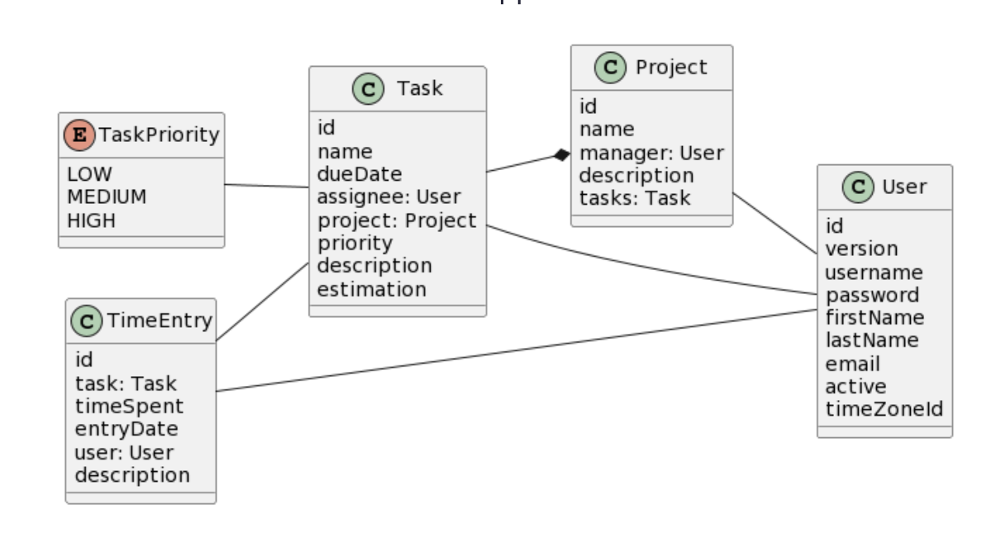

# Full Stack Java Web Development

Modern business applications with Java as a single language for both backend and web UI components.

## Overview

This project demonstrates a full-stack Java web application, using Java for both the backend logic and the frontend UI components. The architecture is designed to enable rapid development and maintainability for modern business applications.

## Features

- Unified development with Java on both frontend and backend
- Clean separation of concerns between layers
- Scalable and modular design
- Suitable for enterprise and commercial use cases

## Project Preview

## Running the Application

The default DB of HSQLDB has been switched to PostgreSQL in application.properties

Build a java File
<pre>./gradlew -Pvaadin.productionMode=true bootJar</pre>

Change Directory into /build/libs and execute Jar File
<pre>java -jar ProjectManagement-0.0.1-SNAPSHOT.jar</pre>
